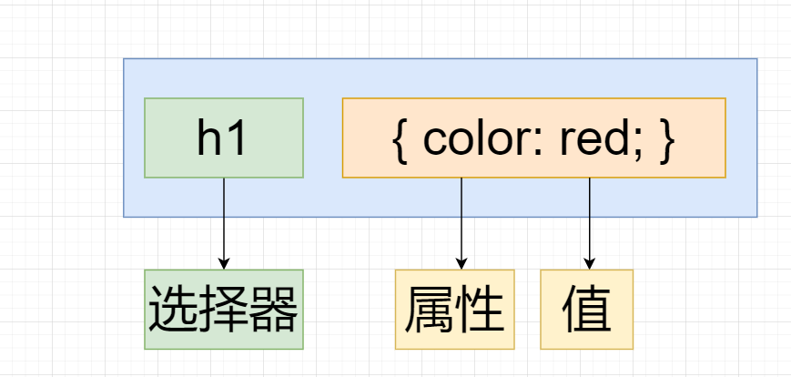

# CSS选择器

## 1、目标

* 能够说出css的定义
* 能够使用css基础选择器
* 能够设置字体样式
* 能够设置文本样式
* 能够说出css三种引入方式
* 能够使用Chrome调试工具调试样式

## 2、CSS简介

> CSS主要使用场景： 美化网页，布局页面

### 2.1 HTML的局限性

​	HTML只关注内容的语义，并没有给网页做排版之类。虽然HTML可以可以做简单样式，但是带来的却是无尽的臃肿和繁琐

### 2.2 CSS-网页美容师

​	CSS是<span style="color: red">层叠样式表</span>（<span style="color: red">Cascading Style Sheets</span>）的简称，有时候也会称为CSS样式表或者级联样式表。CSS也是一种标记语言。

​	CSS主要用于设置HTML页面中的文本内容（字体，大小，对齐方式），图片的外形（宽高、边框样式、边距）以及版面的布局和外观显示样式

​	CSS可以美化HTML，让HTML更加美观，让页面布局更加简单

​	总结：

​	1. HTML主要做页面结构，显示元素内容

   					2. CSS美化HTML，布局网页
   					3. CSS最大价值：由HTML专去做结构层，样式由CSS完成，即结构（HTML）与样式（CSS）相分离

### 2.3 CSS语法规范

​	CSS规则由两个主要的部分构成：选择器以及一条或者多条声明。

​	

- 选择器是用于指定CSS样式的HTML标签，花括号内是对该对象设置的具体样式
- 属性和属性值以键值对的形式出现
- 属性是对指定的对象设置的样式属性，例如：字体大小，文本颜色
- 属性和属性值之间用英文“:”隔开
- 多个键值对之间使用英文“;”隔开

### 2.4 CSS代码风格（不是强制，但是建议）

1. 样式格式书写

   - 紧凑格式

     ```css
     h3 {color: red; font-size: 20px;}
     ```

   - 展开格式

     ```css
     h3 {
         color: red;
         font-size: 20px;
     }
     ```

   - 强烈推荐第二种格式

2. 样式大小写

   - 大写

     ```css
     h3 {
         color: red;
     }
     ```

     

   - 小写

     ```css
     H3 {
         COLOR: RED;
     }
     ```

   - 强烈推荐样式选择器，属性名，属性值，关键字全部使用小写字母

3. 空格规范

   - 属性值前面，冒号后面保留一个空格

   - 选择器（标签）和大括号中间保留空格

     ```css
     h3 {
         color: red;
     }
     ```

## 3、 CSS基础选择器

### 3.1 CSS选择器的作用

> CSS选择器就是根据不同需求把不同的标签选出来这就是选择器的作用。

​	通俗来说：选择标签用的

### 3.2  选择器分类

​	选择器分为基础选择器和复合选择器两大类 

- 基础选择器是由单个选择器组成

- 基础选择器又包括：标签选择器，类选择器，id选择器和通配符选择器

  - 标签选择器：（元素选择器）是指用HTML标签名做为选择器，按标签名称分类。基本语法

    ```css
    标签名 {
        属性：属性值;
    }
    ```

  - 作用：标签选择器可以把某一类标签全部选择出来
  - 优点：能快速为页面中同类型的标签统一设置样式
  - 缺点：不能差异化设置，只能选择全部的当前标签

## 4、CSS字体属性


## 5、CSS文本属性


## 6、CSS的引入方式


##  7、Chrome调试工具（自己实验）

