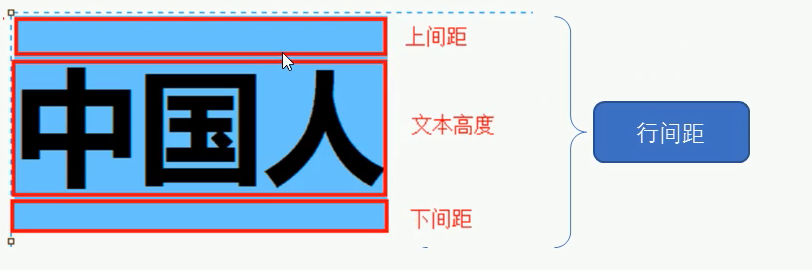

# CSS选择器

## 1、目标

* 能够说出css的定义
* 能够使用css基础选择器
* 能够设置字体样式
* 能够设置文本样式
* 能够说出css三种引入方式
* 能够使用Chrome调试工具调试样式

## 2、CSS简介

> CSS主要使用场景： 美化网页，布局页面

### 2.1 HTML的局限性

​	HTML只关注内容的语义，并没有给网页做排版之类。虽然HTML可以可以做简单样式，但是带来的却是无尽的臃肿和繁琐

### 2.2 CSS-网页美容师

​	CSS是<span style="color: red">层叠样式表</span>（<span style="color: red">Cascading Style Sheets</span>）的简称，有时候也会称为CSS样式表或者级联样式表。CSS也是一种标记语言。

​	CSS主要用于设置HTML页面中的文本内容（字体，大小，对齐方式），图片的外形（宽高、边框样式、边距）以及版面的布局和外观显示样式

​	CSS可以美化HTML，让HTML更加美观，让页面布局更加简单

​	总结：

​	1. HTML主要做页面结构，显示元素内容

   					2. CSS美化HTML，布局网页
   					3. CSS最大价值：由HTML专去做结构层，样式由CSS完成，即结构（HTML）与样式（CSS）相分离

### 2.3 CSS语法规范

​	CSS规则由两个主要的部分构成：选择器以及一条或者多条声明。

​	

- 选择器是用于指定CSS样式的HTML标签，花括号内是对该对象设置的具体样式
- 属性和属性值以键值对的形式出现
- 属性是对指定的对象设置的样式属性，例如：字体大小，文本颜色
- 属性和属性值之间用英文“:”隔开
- 多个键值对之间使用英文“;”隔开

### 2.4 CSS代码风格（不是强制，但是建议）

1. 样式格式书写

   - 紧凑格式

     ```css
     h3 {color: red; font-size: 20px;}
     ```

   - 展开格式

     ```css
     h3 {
         color: red;
         font-size: 20px;
     }
     ```

   - 强烈推荐第二种格式

2. 样式大小写

   - 大写

     ```css
     h3 {
         color: red;
     }
     ```

     

   - 小写

     ```css
     H3 {
         COLOR: RED;
     }
     ```

   - 强烈推荐样式选择器，属性名，属性值，关键字全部使用小写字母

3. 空格规范

   - 属性值前面，冒号后面保留一个空格

   - 选择器（标签）和大括号中间保留空格

     ```css
     h3 {
         color: red;
     }
     ```

## 3、 CSS基础选择器

### 3.1 CSS选择器的作用

> CSS选择器就是根据不同需求把不同的标签选出来这就是选择器的作用。

​	通俗来说：选择标签用的

### 3.2  选择器分类

​	选择器分为基础选择器和复合选择器两大类 

- 基础选择器是由单个选择器组成

- 基础选择器又包括：标签选择器，类选择器，id选择器和通配符选择器

  - 标签选择器：（元素选择器）是指用HTML标签名做为选择器，按标签名称分类。基本语法

    ```css
    标签名 {
        属性：属性值;
    }
    ```

    - 作用：标签选择器可以把某一类标签全部选择出来
    - 优点：能快速为页面中同类型的标签统一设置样式
    - 缺点：不能差异化设置，只能选择全部的当前标签

  - 类选择器：想要差异化选择不同的标签，单独选择一个或者几个标签，可以使用类选择器。

    - 语法：

      ```css
      .类名{
      	属性：属性值；
      	...
      }
      ```

      ```html
      <div class="red">红色</div>
      ```

    - 表示：类选择器在HTML中以`class`属性表示，在CSS中以一个点`.`表示

    - 注意：

      1. 类选择器使用`.`表示，后面跟着自己定义的类名
      2. 长名称或者词组可以使用中横线来为选择器命名
      3. 不要使用纯数字，中文等命名。尽量使用英文字母表示
      4. 命名要有规范，尽量简洁明白

  - 类选择器-多类名：可以给一个标签指定多个类名，达到更多选择目的

    - 使用方式

      ```html
      <div class="red font20">Hello World</div>
      ```

      1. 在标签class中可以写多个类名
      2. 这些类名必须使用空格分开

    - 使用场景：

      1. 把一些标签元素相同的样式(共同的部分)放到一个类里面
      2. 标签可以调用这个公共的类，然后在调用自己独有的类
      3. 修改方便，节省CSS代码

  - id选择器：HTML元素以id属性来设置id选择器，CSS中id选择器用`#`来定义

    - 语法：

    ```css
    #id名字 {
        属性：属性值
        ...
    }
    ```

    - id选择器名字在HTML文档中只能出现一次
    - id选择器和类选择器的区别
      1. 类选择器可以被多个dom节点使用
      2. id选择器只能被一个dom节点使用
      3. id选择器一般用于页面唯一性的元素，经常和JavaScript搭配使用。
      4. 类选择器在修改样式用使用次数最多

  - 通配符选择器：使用`*`来定义，表示选取页面中所有元素

    - 语法：

      ```css
      *{
          属性：属性值
          ...
      }
      ```

    - 通配符选择器不需要调用，自动给所有元素使用样式

    - 特殊情况使用。例如清除页面的内外边距

      ```css
      *{
          margin: 0;
          padding: 0;
      }
      ```

  - 选择器总结

    | 基础选择器   | 作用                 | 特点                               | 使用情况               | 用法                 |
    | ------------ | -------------------- | ---------------------------------- | ---------------------- | -------------------- |
    | 标签选择器   | 选择出相同的标签     | 不能差异化选择                     | 较多                   | `p {clor: red;}`     |
    | 类选择器     | 选出一个或者多个标签 | 根据需求选择                       | 非常多                 | `.nav {color: red;}` |
    | id选择器     | 一次只能选一个标签   | ID属性只能在每个HTML文档中出现一次 | 一般和就JavaScript搭配 | `#nav{color: red;}`  |
    | 通配符选择器 | 选择所有标签         | 选择的太多，可以作为公用样式       | 特殊情况使用           | `*{color: red;}`     |

    

## 4、CSS字体属性

> CSS Fonts（字体）属性用来定义字体系列、大小、粗细和文字样式

### 4.1 字体系列

CSS使用`font-family`属性定义文本的字体雅安市

```css
p {font-family: "微软雅黑";}
div {font-family: Arial, "Microsoft Yahei", "微软雅黑";}
```

- 各种字体之间必须使用引文状态下的逗号隔开
- 如果有空格隔开的多个单词组成的字体，加引号
- 尽量使用系统默认字体，保证兼容性

### 4.2 字体大小

CSS使用`font-size`属性定义字体大小

```css
p{
    font-size: 20px;
}
```

- px（像素）大小是网页中最常用的单位
- 谷歌浏览器默认的文字大小为16px
- 不同浏览器可能默认显示的字号大小不一样，可以使用上面的通配选择符改为一样大小
- 可以给body指定整个页面文字的大小

### 4.3 字体粗细

CSS使用`font-weight`属性设置字体的粗细

```css
p{
    font-weight: bold;
}
```

| 属性值  | 描述                         |
| ------- | ---------------------------- |
| normal  | 默认值（不加粗）             |
| bold    | 定义粗体（加粗）             |
| 100-999 | 400和normal等同，700等同bold |

- 更加习惯用数字表示粗体

### 4.4 文字样式

CSS使用`font-style`属性设置文本风格

```css
p{
    font-style: normal;
}
```

| 属性值 | 作用                               |
| ------ | ---------------------------------- |
| normal | 默认值，浏览器会显示标准的字体样式 |
| italic | 浏览器会显示倾斜的字体             |

**注意**：很少加斜体，有时要将斜体标签（`em，i`）改为不倾斜体

### 4.5 字体复合属性

字体属性可以把以上文字样式综合来写

```css
body{
    font: font-style font-weight font-size/line-height font-family;
}
```

- 使用font属性时，必须按照上面语法格式中的顺序来书写，不能更换顺序，并且各个属性间以空格隔开
- 不需要设置的属性可以省略（取默认值），但必须保留`font-size`和`font-family`属性，否则font属性将不起作用

### 4.6 字体属性总结

| 属性        | 作用     | 注意点                                               |
| ----------- | -------- | ---------------------------------------------------- |
| font-size   | 字号     | 通常使用的单位是px（像素），一定要跟上单位           |
| font-family | 字体     | 实际工作中按照团队约定来写字体                       |
| font-weight | 字体粗细 | 加粗是700或者bold；normal或者400是不加粗             |
| font-style  | 字体样式 | 倾斜是italic；不倾斜是normal                         |
| font        | 字体连写 | 字体连写有顺序，不能随意更换。字号和字体必须同时出现 |

- 字体复合属性怎么写，里面有什么注意细节？
  - `font: font-style font-weight font-size font-family`
  - 顺序不能颠倒
  - 字体和字号必须同时出现
- 如何让加粗文字不加粗显示，如何让倾斜的文字不倾斜显示？
  - 使用`font-weight：400`或者`font-weight：normal`（不加粗）
  - 使用`font-style: normal`

## 5、CSS文本属性

> CSS Text（文本）属性可以定义文本的外观，比如文本的颜色，对齐文本，装饰文本，文本缩进、行间距等

### 5.1 文本颜色

`color`属性用来定义文本颜色

```css
div{
    color: red;
}
```

| 描述         | 属性值                                                       |
| ------------ | ------------------------------------------------------------ |
| 预定的颜色值 | red，green，blue，...                                        |
| 十六进制     | #FF0000，#FF6600,...                                         |
| RGB代码      | rgb(255,0,0)或者rgb(100%,0,0)或者rgba(255，0，0，0.6)(用来定义透明度) |

### 5.2 对齐文本

`text-align`属性用来设置元素内文本内容的水平对齐方式

```css
div{
    text-align: center;
}
```

| 属性值 | 作用           |
| ------ | -------------- |
| left   | 左对齐（默认） |
| right  | 右对齐         |
| center | 居中对齐       |

### 5.3 装饰文本

`text-decoration`属性规定添加到文本的修改，可以给文本添加下划线，删除线，上划线等

```css
div{
    text-decoration: underline;
}
```

| 属性值       | 描述                              |
| ------------ | --------------------------------- |
| none         | 默认，没有装饰（最常用）          |
| underline    | 下划线。超链接a自带下划线（常用） |
| overline     | 上划线                            |
| line-through | 删除线                            |

### 5.4 文本缩进

`text-indent`属性用来指定文本的第一行缩进。通常是将段落的首行缩进

```css
div{
    text-indent: 10px
}
```

通过设置该属性，将所有元素的第一行都可以缩进一个给定的长度，甚至该长度可以是负值

```css
p{
    text-indent: 2em;
}
```

**注意**：em是一个相对单位，就是当前元素（font-ssize）1个文字的大小，如果当前元素没有设置大小，则会按照父元素的1个文字大小

### 5.5 行间距

`line-height`属性用来设置行间的距离（行高）。可以控制文字行与行之间的距离

```css
p{
    line-height: 26px;
}
```



### 5.6 文本属性总结

| 属性            | 描述     | 注意点                                            |
| --------------- | -------- | ------------------------------------------------- |
| color           | 文本颜色 | 通常用十六进制，可以简写。例如#ffffff可以写为#fff |
| text-align      | 文本对齐 | 设定文字水平的对齐方式                            |
| text-indent     | 文本缩进 | 用于首段缩进2个字的间距<br />text-indent: 2em     |
| text-decoration | 文本修饰 | 添加下划线：underline；取消下划线：none           |
| line-height     | 行高     | 控制行与行之间的距离                              |

## 6、CSS的引入方式

> 按照CSS修改书写的位置（或者引入方式）。

### 6.1 CSS样式表分类

CSS样表可以分为三大类

1. 行内样式表（行内式）
2. 内部样式表（嵌入式）
3. 外部样式表（连接式）

### 6.2 内部样式表

内部样式表（内嵌样式表）是写到HTML页面内部，是将所有的CSS代码抽取出来，单独放到一个style标签中

```html
<style>
    div{
        color: red;
        font-size: 12px;
    }
</style>
```

- style标签理论上可以放到HTML文档的任何地方，但一般会放到文档的head标签中
- 通过这种方式，可以方便控制当前整个页面中的元素样式设置
- 代码结构清晰，但是没有实现结构与样式完全分离
- 使用内部样式表设定CSS，通常被称为嵌入式引用

### 6.3 行内样式表

行内样式表（内连样式表）是在元素标签内部的style属性中设定CSS样式。适合简单修改

```html
<div style="color: red";font-size: 16px>Hello World</div>
```

- style其实就是标签的属性
- 在双引号中间，要符合CSS规范
- 控制当前标签设置样式
- 由于书写频繁，并且没有体现结构与样式相分离的思想，所以不推荐大量使用，只有对当前元素添加简单样式的时候，可以考虑使用
- 使用行内样式设定CSS，通常也被称为行内式引入


##  7、Chrome调试工具（自己实验）

