# 01_浏览器工作原理

## 1. JavaScript难点

## 2. 浏览器工作原理

JavaScript代码在浏览器中是如何被执行的

## 3. 浏览器内核

不同的浏览器有不同的内核组成

- `Gecko`：早期被Netscape和Mozilla Firefox浏览器浏览器使用
- `Trident`：微软开发，被IE4~IE11浏览器使用，但是Edge浏览器已经转向Blink；
- `Webkit`：苹果基于HTML开发、开源的，用于Safari，Google Chrome之前也在使用；
- `Blink`：是Webkit的一个分支，Google开发，目前应用于Google Chrome，Edge，Opera等；
- .......等等

事实上，经常说的浏览器内核指定是浏览器的排版引擎：

- 排版引擎： 也称为浏览器引擎，页面渲染引擎，样板引擎

## 4. 浏览器渲染过程

在这个执行过程中，HTML解析的时候遇到了JavaScript标签，会停止解析HTML，而去加载和执行JavaScript代码

## 5. 认识JavaScript引擎

### 为什么需要JavaScript引擎呢？

- 我们前面说过，`高级的编程语言`都是需要转成最终的`机器指令`来执行的；
- 事实上我们编写的JavaScript无论你交给`浏览器或者Node执行`，最后都是需要被`CPU执行`的；
- 但是CPU只认识`自己的指令集`，实际上是`机器语言`，才能被CPU所执行；
- 所以我们需要`JavaScript引擎`帮助我们将`JavaScript代码`翻译成`CPU指令`来执行；

### 比较常见的JavaScript引擎有哪些呢？

- SpiderMonkey ： 第-款JavaScript引Y，由Brendan Eich开发（也就是JavaScript作者）；
- Chakra：微软开发，用于IT浏览器；
- JavaScriptCore ： WebKit中的JavaScript引Y， Apple公司开发；
- `V8`： Google开发的强大JavaScript引擎，也帮助Chrome从众多浏览器中脱颖而出；

## 6. 浏览器内核和js引擎的关系

这里我们先以WebKit为例，WebKit事实上由两部分组成的：

- WebCore：负责HTML解析、布局、宣染等等相关的工作；
- JavaScriptCore：解析、执行JavaScript代码；

上次时间：01.09.10